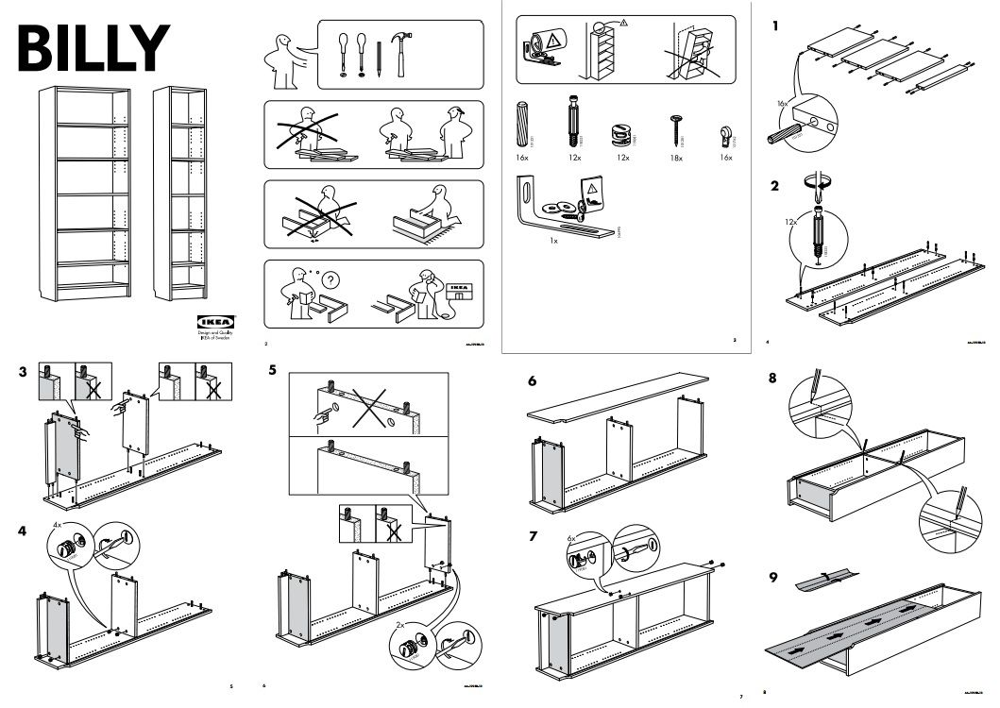
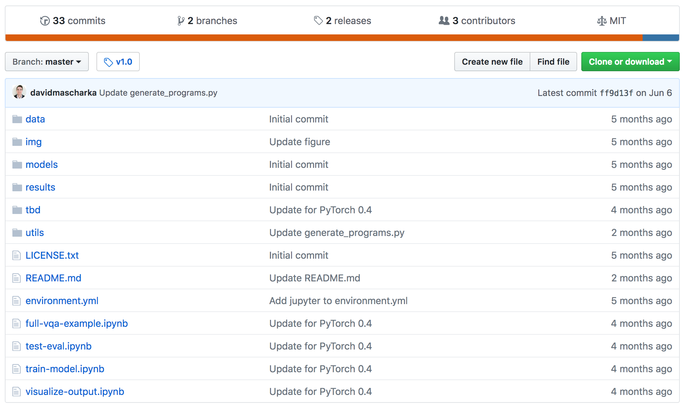
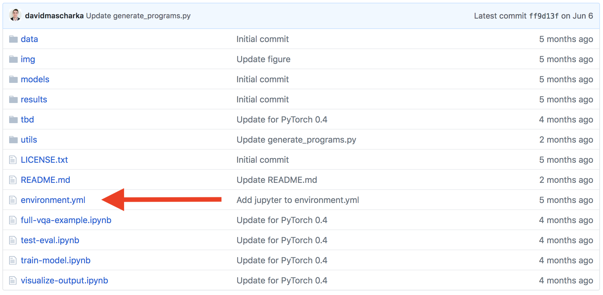
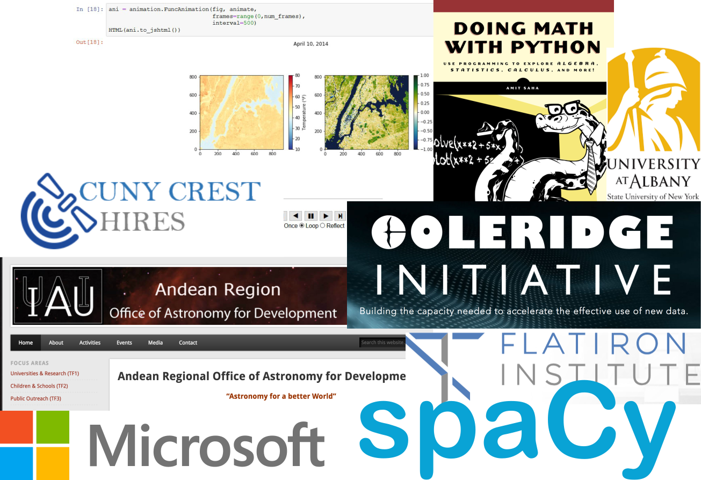

class: middle, center, title-slide

# Binder


.footnote[Tim Head for the Binder team, Wild Tree Tech, JupyterCon 2018]

---

# Libraries

.center.width-60[]

.footnote[By <a href="//commons.wikimedia.org/wiki/User_talk:F%C3%A6" title="User talk:Fæ">Fæ</a>, <a href="https://creativecommons.org/licenses/by-sa/3.0" title="Creative Commons Attribution-Share Alike 3.0">CC BY-SA 3.0</a>, <a href="https://commons.wikimedia.org/w/index.php?curid=10939144">Link</a>]

???

Earliest libraries were archives of clay tablets. Appeared in Mesopotamia about 2600BC. Making clay tablets was hard work, as you could imagine. Recording information is something humans have been doing for a very long time. It is a valuable thing to do! Information is power.

---

# Libraries

.center.width-100[]

???

Things have changed a bit since then. We invented paper and the printing press.
At first access was restricted, you had to pay or prove you were a real scholar to get access. The ideas of the modern public library only started around 1850 or so.
Now spreading information via books and documents has become easy! We can do this at scale!

---

# Libraries

.center.width-100[]

???

Modern libraries are modern!

---

# Libraries?

.center.width-100[]

???

But you hardly ever go there anymore, these days a large part of the work of a library is to broker access to digital information and to curate that information.

---

# Is Paper Obsolete?

<video autoplay="autoplay" loop="loop" muted="muted"
      playsinline="playsinline"
      poster="img/SciencePaperFlames-New.jpg"
      style="width:100%; height:100%"
      webkit-playsinline="webkit-playsinline">
  <source src="img/SciencePaperFlames-New.mp4" />
</video>

.footnote[https://www.theatlantic.com/science/archive/2018/04/the-scientific-paper-is-obsolete/556676/]

---

# Newton's Third Law

.larger[
> The third law states that all forces between two objects exist in equal magnitude and opposite direction: if one object A exerts a force $F_A$ on a second object B, then B simultaneously exerts a force $F_B$ on A, and the two forces are equal in magnitude and opposite in direction.
]

or

---

# Newton's Third Law

.middle.larger[
$$
F_A = -F_B
$$
]

.footnote[From https://en.wikipedia.org/wiki/Newton%27s_laws_of_motion, August 2018]

???

Today experiments can't be described on a static piece of paper anymore. It is like using text to describe Newton's laws instead of using equations. Text takes a lot more space and is less precise than using maths. Today's experiments involve software which is essential to understanding the work that happened. We need to communicate more than just text.

We need a new medium.

paper == static

---

# Going beyond paper

.center.width-90[]

???

With just the static paper it isn't actually well defined what they did. This
means that we can't reproduce their work because we don't actually know
what it is they did.

---

# Going beyond paper

.center.width-90[]

???

We need the code and the environment in which that code was run in order
to have a full definition of what it is they did. Now we can start
discussing about reproducing their work.

---
class: middle, center

# Let's do it

<a href="https://mybinder.org/v2/gh/betatim/tbd-nets/binder?filepath=visualize-output.ipynb" class="center width-50"></a>

---

blank

https://distill.pub/2018/editorial-update/#figure-spectrum we are seeing the trend to including notebooks already

???

This means that producing information is basically free now, but successfully consuming it has never been harder. It is very likely that computer programs played a role in generating that information, so you need

---

class: middle, center

# Today's Talk:
# Running other people's code

---

# Other people's code is ... fun?!

.center.width-70[]

.footnote[From https://xkcd.com/1987/]

---

# The IT Department Approach

Your IT department tightly controls what can be installed, there are
approved tools that you shall use.

.center.width-100[]

???

Conversations go something like:

**A:** Could we upgrade our scikit-learn version? They fixed several bugs that we have been working around for the last 6 months.

**B:** Any new versions need to be audited first.

**A:** Ok, well, I guess we keep working around the issues then ...

---

# The Wild West Approach

Anything goes, all the modern tools, all the time. This is the frontier!

.center.width-100[]

???

You have discussions like:

**A:** I tried to run your script to generate the charts of our monthly sales numbers. It complains about not finding the Shedazzle shell??

**B:** Ah yeah, Shedazzle is the latest in AI powered productivity shell, everyone is using it now, you should also change. Bash really hurts your productivity.

**A:** Ah ok, so ... uhm I guess I'll try installing Shedazzle then ...

**B:** Make sure to install the latest beta, the current release is a bit flakey.

**A:** Ok ... all I wanted to do is make a few charts ...

---

# The Kitchen Sink Approach

.center.width-80[]

???

Package up everything together with your code. Libraries, dependencies,
everything. Makes a huge bundle.

Technically speaking this is sending a VM or a container image.

---

# The Ikea Manual Approach

.center.width-90[]

???

Deliver the instructions for assembling the kitchen sink approach.

Technically speaking this is like sending a Dockerfile instead of
the built container image.

---

class: middle, center

# Idea: Dockerfiles for everything.

---

# Do we have to use containers?

.center.width-20[]

But my language has a package manager!

* language specific tools work well if you only use one language
* some tools are easier to install via the operating system's package manager
* real world projects use several languages

To specify the complete computational environment a container is the right
level of abstraction.

---

# Easy?

.larger[Crafting a good Dockerfile requires significant expertise.]

--

.center.width-60[]

---

# How did that paper do it?

.center.width-100[]

Nothing suspicious to see ...

---

class: middle, center

# repo2docker

---

class: middle, center

# repo2docker builds and runs containers
---

# repo2docker builds and runs containers

Mimics what a human would do:

```
$ git clone https://github.com/davidmascharka/tbd-nets
```
--

Analyse repository:

.center.width-100[]

---

# repo2docker builds and runs containers

Mimics what a human would do:

```
$ git clone https://github.com/davidmascharka/tbd-nets
```

Analyse repository and install dependencies:

```
$ conda install -f environment.yml
```

--

Start Jupyter notebook:

```
$ jupyter notebook
```

---

# repo2docker understands you

It can parse many different files that specify what dependencies to install.
This means that you can keep working the way you have always been working,
and benefit from `repo2docker` from day one.

Supported configuration files:
.larger[
.left-column[
* `requirements.txt`
* `environment.yml`
* `apt.txt`
* `REQUIRE`
]
.right-column[
* `install.R`
* `runtime.txt`
* `postBuild`
* `Dockerfile`
]
]

---

Video of using repo2docker locally.

---

# Back to sharing

```
Hi Tim,

thanks for helping out on our project. To run things
you need to install Docker, repo2docker and then run

repo2docker https://github.com/davidmascharka/tbd-nets

It produces a lot of output but at the end there is
a URL that you need to paste into your browser. That
will show a Jupyter notebook.

Tina
```

.larger[
Can we make it even easier?

Maybe just a link people can click?
]

---

class: middle, center

# Of course!

<a href="https://mybinder.org/v2/gh/norvig/pytudes/master" class="center width-50"></a>

---

class: middle, center

# Binding it all together

---

# We have all the pieces

.center[

.width-40[]

.larger[+

repo2docker

+]

.width-40[]
]

<a class="github-fork-ribbon" href="https://conferences.oreilly.com/jupyter/jup-ny/public/schedule/detail/71218" data-ribbon="Min's talk (2.40pm)" title="Min's talk (2.40pm)">Min's talk (2.40pm)</a>

---

# JupyterHub with ondemand containers: BinderHub!

.center.width-100[]


???

Combine `repo2docker` with JupyterHub to build images for any git repository
ondemand.

We call it BinderHub.


---

# https://mybinder.org

A public BinderHub operated by the Binder team.

.center.width-100[]

<a class="github-fork-ribbon" href="https://conferences.oreilly.com/jupyter/jup-ny/public/schedule/detail/68437" data-ribbon="Yuvi's talk (now)" title="Yuvi's talk">Yuvi's talk (now)</a>

---

# Not just Jupyter Frontends

https://github.com/binder-examples/r

.center.border.width-100[]

Bokeh app https://github.com/binder-examples/bokeh

---

# Be a Part of the Community!

.center.border.width-100[]

* and many more who aren't captured in GitHub history
* Join us at https://github.com/jupyterhub/binder
* Chat with us https://gitter.im/jupyterhub/binder
* Become part of the community!

---

# Around the world in 80 days

.center.width-90.border[]

In the last 80 days we have had users from almost everywhere on the planet.

???

Some countries we are missing: Cuba, North Korea, Chad, Central African Republic, Western Sahara, Mali, Guinea-Bissau, Eritrea. (Is Spitzbergen a country?)

---

# Showing Off 🎉

About 1.2 million page views since 1st January 2018.

Daily launches:

.center.border.width-100[]

Daily launches without [jupyter.org/try](https://jupyter.org/try):

.center.border.width-100[]

You can't read these, that is fine, there are about five grains of salt you'd need to apply anyway.

---


# A Selection of Users

.center.width-90[]

Most of the interesting users are in the "long tail", so takes a lot of effort to find.

???

https://github.com/wichit2s/programmingfundamentals/ - University course in Thailand

https://github.com/msereiko/coding_workshop - NYC coding for students

https://github.com/AndeanROAD/PythonISYA - Andean Regional Office of Astronomy for Development

https://github.com/Coleridge-Initiative - http://coleridgeinitiative.org/

https://github.com/fboylu/binder - Microsoft internal training event, you've made it when MS asks for your help right?

https://github.com/fonnesbeck/cqs_machine_learning

https://github.com/story645/EAS213
For the CUNY-CREST summer high school research experience (HIRES), 26 NYC students spent about a week learning Python for earth and atmospheric science."
HIRES is the High School Initiative in Remote Sensing of the Earth Systems Engineering and Sciences
---

# Back to libraries

Libraries have always been about curating and spreading knowledge!

First libraries archived clay tablets, then books, followed by managing access to PDFs, next ...

--
.larger[
...a BinderHub in every library.
]

.center.width-60[]
---

# Binder is Pretty Cool

Combines the stability and scalability of JupyterHub with ondemand image building.

Anyone who wants to can now make their computational project "one click" usable: [](https://mybinder.org/v2/gh/AllenDowney/ThinkDSP/master?filepath=code%2Fcacophony.ipynb)

Based on state of the art cloud orchestration tools.

Can be deployed by anyone: https://binderhub.readthedocs.io/en/latest/

---

---

class: middle, center

# Encore

---

# Not Just Jupyter

BinderHub also works with RStudio or Shiny.

https://github.com/binder-examples/r

You can also use a tool like OpenRefine

https://github.com/betatim/openrefineder/

---

# Challenge

Can you (this room) move the needle on the number of live binders?

.larger[
Visit http://bit.ly/2t9Bjql to launch your first binder.
]

https://grafana.mybinder.org/d-solo/fZWsQmnmz/pod-activity?refresh=30s&orgId=1&panelId=3

---

# Slides about Binder using Binder

You can embed code in your HTML, and with a bit of JavaScript magic
make it executable, powered by a BinderHub.

<pre data-executable="true" data-language="python">%matplotlib inline
import numpy as np
import matplotlib.pyplot as plt
x = np.linspace(0,10)
plt.plot(x, np.sin(x))
plt.plot(x, np.cos(x))
</pre>

---

# Interactive documentation

.center.width-50[]

What is better than documentation? Documentation with interactive
examples you can run right there!

[Juniper demo](./juniper.html)

https://spacy.io/usage/linguistic-features#pos-tagging

---

# GUI like things

* https://github.com/binder-examples/appmode
* https://github.com/SimonBiggs/scriptedforms/blob/master/README.md

---

# Real GUIs - X servers!

* https://mybinder.org/v2/gh/betatim/nbnovnc/add-xeyes

.center.width-100.border[]


---

# Wild Tree Tech

.center.width-10[]

Tim is a doctor of experimental physics, worked at CERN and EPFL,
contributor to the PyData ecosystem.

Wild Tree Tech builds bespoke solutions for clients all around the world,
from startups to UN organisations.

* digital products that leverage machine-learning and AI,
* small and large JupyterHub deployments.

Visit [http://www.wildtreetech.com](www.wildtreetech.com).

---

class: bottom, center

# Fin.
