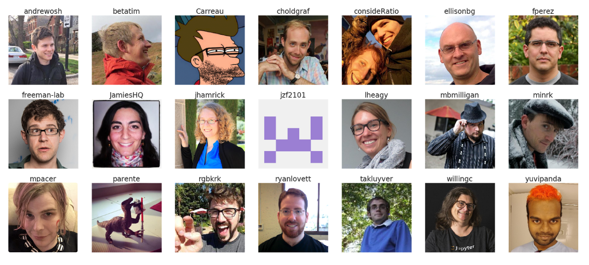

class: middle, center, title-slide

# Binder


.footnote[Tim Head for the Binder team, Wild Tree Tech, JupyterCon 2018]

---

# Libraries

.center.width-60[]

.footnote[By <a href="//commons.wikimedia.org/wiki/User_talk:F%C3%A6" title="User talk:Fæ">Fæ</a>, <a href="https://creativecommons.org/licenses/by-sa/3.0" title="Creative Commons Attribution-Share Alike 3.0">CC BY-SA 3.0</a>, <a href="https://commons.wikimedia.org/w/index.php?curid=10939144">Link</a>]

???

Earliest libraries were archives of clay tablets. Appeared in Mesopotamia about 2600BC. Making clay tablets was hard work, as you could imagine. Sharing and recording information is something humans have been doing for a very long time.

---

# Libraries

.center.width-100[]

???

Things have changed a bit since then. We invented paper and the printing press. Spreading information via books and documents has become easy! We can do this at scale!

---

# Libraries

.center.width-100[]

???

Modern libraries are modern!

---

# Libraries?

.center.width-80[]

???

But you hardly ever go there anymore, these days a large part of their work
is to broker access to digital information.

---

# Information is now digital

<!--


.footnote[By <a href="//commons.wikimedia.org/wiki/User:Diliff" title="User:Diliff">Diliff</a> - <span class="int-own-work" lang="en">Own work</span>, <a href="https://creativecommons.org/licenses/by/2.5" title="Creative Commons Attribution 2.5">CC BY 2.5</a>, <a href="https://commons.wikimedia.org/w/index.php?curid=564849">Link</a>] -->

.larger[An article about computational science in a scientific publication is not the scholarship itself, it is merely advertising of the scholarship. The actual scholarship is the complete software development environment and the complete set of instructions which generated the figures.]

-- _Buckheit and Donoho
(paraphrasing John Claerbout),
WaveLab and Reproducible Research, 1995_

???
Needs a picture. Illustrate point that information is now in computers and code, not paper or PDF anymore.

---

<blank>

???

This means that producing information is basically free now, but successfully consuming it has never been harder. It is very likely that computer programs played a role in generating that information, so you need

---

class: middle, center

# Today: Getting other people's code to run

---

# Other people's code is ... fun?!

.center.width-70[]

.footnote[From https://xkcd.com/1987/]

---

# The Wild West Model

Anything goes, all the modern tools, all the time.

You have discussions like:

**A:** I tried to run your script to generate the charts of our monthly sales numbers. It complains about not finding the Shedazzle shell??

**B:** Ah yeah, Shedazzle is the latest in AI powered shell, everyone is using it now, you should also change. bash really hurts your productivity.

**A:** Ah ok, so ... uhm I guess I'll try installing Shedazzle then ...

**B:** Make sure to install the latest beta, current release is a bit flakey.

---
# The Corporate IT Lockdown Model

Your IT department tightly controls what can be installed, there are
approved tools that you shall use.

**A:** Could we upgrade our scikit-learn version? They fixed several bugs that we have been working around for the last 6 months.

**B:** Any new versions need to be audited first. Let me CC **C** from audits.

**C:** Correct, all new code needs to be audited. We have a monthly meeting to prioritise the audit backlog.

**D:** The Audit department needs a bigger headcount if we are meant to do more audits.

**A:** Ok, well, I guess we keep working around the issues then ...

---

# What do we need for practical code sharing?

* The computational tools to solve a problem
* A way to pack it all so others can use it
* A way to communicate and share our work
* A way to only depend on tools everyone has (browsers!)
* A way to do all of this relatively easily and accessibly

---

# Open-source languages

.gallery[


]

---

# Web native editors

.gallery[


]

... and many more.

---

# Sharing your work

.gallery[


]

---

# Specifying dependencies

.center.width-20[]

But my language has a package manager!

* language specific tools work well if you only use one language
* some tools are easier to install via the operating system's package manager
* real world projects use several languages

To specify the complete computational environment a container is the right
level of abstraction.

---

# Easy?

.larger[All the technical pieces exist but they require significant expertise to operate
and combine.]

--

.center.width-60[]

---

# Just use our framework!

.center.width-100[]

---

class: middle, center

# repo2docker

---

# Creating Containers

Writing a `Dockerfile` is hard, and tedious. Not my definition of fun.

Most programming languages already have a way to specify dependencies.

Can't we automate creating a Docker image?

---

# repo2docker builds and runs containers from a directory

.center.width-100[]

---

# repo2docker understands you

It can parse many different files that specify what dependencies to install.
This means that you can keep working the way you have always been working,
and benefit from `repo2docker` from day one.

Supported configuration files:
* `requirements.txt`
* `environment.yml`
* `apt.txt`
* `REQUIRE`
* `install.R`
* `runtime.txt`
* `postBuild`
* `Dockerfile`

---

.center.width-100.border[]

---

# Back to sharing

```
Hi Tim,

thanks for helping out on our project. To run things
you need to install Docker, repo2docker and then run

repo2docker https://github.com/norvig/pytudes/

It produces a lot of output but at the end there is
a URL that you need to paste into your browser. That
will show a Jupyter notebook.

Tina
```

.larger[
Can we make it even easier?

Maybe just a link people can click?
]

---

class: middle, center

# Of course!

<a href="https://mybinder.org/v2/gh/norvig/pytudes/master" class="center width-50"></a>

---

class: middle, center

# Binding it all together

---

# We have all the pieces

.center[

.width-40[]

.larger[+

repo2docker

+]

.width-40[]
]

<a class="github-fork-ribbon" href="https://conferences.oreilly.com/jupyter/jup-ny/public/schedule/detail/71218" data-ribbon="Min's talk (2.40pm)" title="Min's talk (2.40pm)">Min's talk (2.40pm)</a>

---

# JupyterHub with ondemand containers: BinderHub!

.center.width-100[]


???

Combine `repo2docker` with JupyterHub to build images for any git repository
ondemand.

We call it BinderHub.


---

# https://mybinder.org

A public BinderHub operated by the Binder team.

.center.width-100[]

<a class="github-fork-ribbon" href="https://conferences.oreilly.com/jupyter/jup-ny/public/schedule/detail/68437" data-ribbon="Yuvi's talk (now)" title="Yuvi's talk">Yuvi's talk (now)</a>

---

# Not just Jupyter Frontends

https://github.com/binder-examples/r

.center.border.width-100[]

Bokeh app https://github.com/binder-examples/bokeh

---

# Part Of The Community!

.center.border.width-100[]

* and many more who aren't captured in GitHub history
* Join us at https://github.com/jupyterhub/binder
* Chat with us https://gitter.im/jupyterhub/binder
* Become part of the community!

---

# Around the world in 80 days

.center.width-90.border[]

In the last 80 days we have had users from all but eight countries on Earth. Cuba, North Korea, Chad, Central African Republic, Western Sahara, Mali, Guinea-Bissau, Eritrea. (Is Spitzbergen a country?)

---

# A Selection of users

https://github.com/wichit2s/programmingfundamentals/ - University course in Thailand

https://github.com/msereiko/coding_workshop - NYC coding for students

https://github.com/AndeanROAD/PythonISYA - Andean Regional Office of Astronomy for Development

https://github.com/Coleridge-Initiative - http://coleridgeinitiative.org/

https://github.com/fboylu/binder - Microsoft internal training event, you've made it when MS asks for your help right?

---

# Back to libraries

Libraries have always been about curating and spreading knowledge!

First libraries archived clay tablets, then books, followed by managing access to PDFs, next ...

--
.larger[
...a BinderHub in every library.
]
---

# BinderHub is a step forward in making computational work easier to reproduce

Combines the stability and scalability of JupyterHub with ondemand image building.

Anyone who wants to can now make their computational project "one click" reproducible: [](https://mybinder.org/v2/gh/AllenDowney/ThinkDSP/master?filepath=code/cacophony.ipynb)

Based on state of the art cloud orchestration tools.

Can be deployed by anyone: https://binderhub.readthedocs.io/en/latest/

---

---

class: middle, center

# Encore

---

# Not Just Jupyter

BinderHub also works with RStudio or Shiny.

https://github.com/binder-examples/r

You can also use a tool like OpenRefine

https://github.com/betatim/openrefineder/

---

# Challenge

Can you (this room) move the needle on the number of live binders?

.larger[
Visit http://bit.ly/2t9Bjql to launch your first binder.
]

https://grafana.mybinder.org/d-solo/fZWsQmnmz/pod-activity?refresh=30s&orgId=1&panelId=3

---

# Slides about Binder using Binder

You can embed code in your HTML, and with a bit of JavaScript magic
make it executable, powered by a BinderHub.

<pre data-executable="true" data-language="python">%matplotlib inline
import numpy as np
import matplotlib.pyplot as plt
x = np.linspace(0,10)
plt.plot(x, np.sin(x))
plt.plot(x, np.cos(x))
</pre>

---

# Interactive documentation

.center.width-50[]

What is better than documentation? Documentation with interactive
examples you can run right there!

[Juniper demo](./juniper.html)

https://spacy.io/usage/linguistic-features#pos-tagging

---

# GUI like things

* https://github.com/binder-examples/appmode
* https://github.com/SimonBiggs/scriptedforms/blob/master/README.md

---

# Real GUIs - X servers!

* https://mybinder.org/v2/gh/betatim/nbnovnc/add-xeyes

.center.width-100.border[]


---

# Wild Tree Tech

.center.width-10[]

Tim is a doctor of experimental physics, worked at CERN and EPFL,
contributor to the PyData ecosystem.

Wild Tree Tech builds bespoke solutions for clients all around the world,
from startups to UN organisations.

* digital products that leverage machine-learning and AI,
* small and large JupyterHub deployments.

Visit [http://www.wildtreetech.com](www.wildtreetech.com).

---

class: bottom, center

# Fin.
