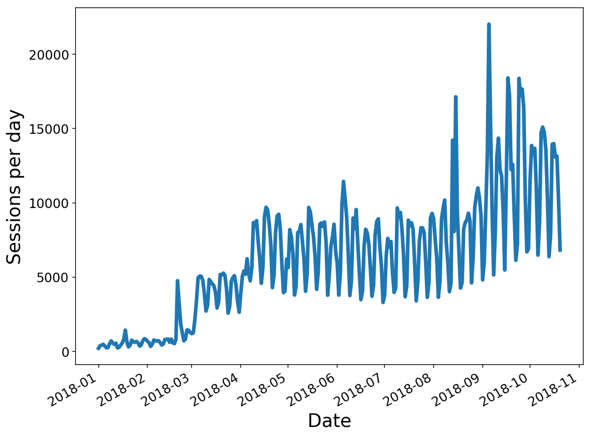

class: middle, center, title-slide

# Binder


.footnote[Tim Head for the Binder team, PyconDE 2018]

---

# Libraries

.center.width-60[]

.footnote[By <a href="//commons.wikimedia.org/wiki/User_talk:F%C3%A6" title="User talk:Fæ">Fæ</a>, <a href="https://creativecommons.org/licenses/by-sa/3.0" title="Creative Commons Attribution-Share Alike 3.0">CC BY-SA 3.0</a>, <a href="https://commons.wikimedia.org/w/index.php?curid=10939144">Link</a>]

???

Earliest libraries were archives of clay tablets. Appeared in Mesopotamia about 2600BC. Making clay tablets was hard work, as you could imagine. Recording information is something humans have been doing for a very long time. It is a valuable thing to do! Information is power.

---

# Libraries

.center.width-100[]

???

Things have changed a bit since then. We invented paper and the printing press.
At first access was restricted, you had to pay or prove you were a real scholar to get access. The ideas of the modern public library only started around 1850 or so.
Now spreading information via books and documents has become easy! We can do this at scale!

---

# Libraries

.center.width-100[]

???

Modern libraries are modern!

---

# Libraries?

.center.width-100[]

???

But you hardly ever go there anymore, these days a large part of the work of a library is to broker access to digital information and to curate that information.

---

# Is Paper Obsolete?

<video autoplay="autoplay" loop="loop" muted="muted"
      playsinline="playsinline"
      poster="img/SciencePaperFlames-New.jpg"
      style="width:100%; height:100%"
      webkit-playsinline="webkit-playsinline">
  <source src="img/SciencePaperFlames-New.mp4" />
</video>

.footnote[https://www.theatlantic.com/science/archive/2018/04/the-scientific-paper-is-obsolete/556676/]

---

# Going beyond paper

.center.width-90[]

???

With just the static paper it isn't actually well defined what they did. This
means that we can't reproduce their work because we don't actually know
what it is they did.

---

# Going beyond paper

.center.width-90[]

???

We need the code and the environment in which that code was run in order
to have a full definition of what it is they did. Now we can start
discussing about reproducing their work.

---
class: middle, center

# Let's do it

<a href="https://mybinder.org/v2/gh/betatim/tbd-nets/binder?filepath=visualize-output.ipynb" class="center width-50"></a>

---

class: middle, center

# That was Binder.

???

This means that producing information is basically free now, but successfully consuming it has never been harder. It is very likely that computer programs played a role in generating that information, so you need to have access to them as well as the text itself

---

class: middle, center

# Let me explain how it works.

---

class: middle, center

# Today's Talk:
# Running other people's code

---

# Other people's code is ... fun?!

.center.width-70[]

.footnote[From https://xkcd.com/1987/]

---

# The IT Department Approach

Your IT department tightly controls what can be installed, there are
approved tools that you shall use.

.center.width-100[]

---

# The Wild West Approach

Anything goes, all the modern tools, all the time. This is the frontier!

.center.width-100[]

---

# The Kitchen Sink Approach

.center.width-80[]

.footnote[Credit: ENI Norge]

---

# The Ikea Manual Approach

.center.width-90[]

---

class: middle, center

# Idea: Dockerfiles for everything.

---

# Easy?

.larger[Crafting a good Dockerfile requires significant expertise.]

These are the six lines you need to install one package:

```
RUN apt-get update && \
    apt-get install --yes --no-install-recommends \
*       less && \
    apt-get purge && \
    apt-get clean && \
    rm -rf /var/lib/apt/lists/*
```

---

# Easy?

.larger[Crafting a good Dockerfile requires significant expertise.]

.center.width-60[]

---

# How did that paper do it?

.center.width-100[]

Nothing suspicious to see ...

---

class: middle, center

# BinderHub uses repo2docker

---

class: middle, center

# repo2docker builds and runs containers

---

# repo2docker builds and runs containers

Mimics what a human would do:

```
$ git clone https://github.com/davidmascharka/tbd-nets
```
--

Analyse repository:

.center.width-100[]

---

# repo2docker builds and runs containers

Mimics what a human would do:

```
$ git clone https://github.com/davidmascharka/tbd-nets
```

Analyse repository and install dependencies:

```
$ conda install -f environment.yml
```

--

Start Jupyter notebook:

```
$ jupyter notebook
```

---

# repo2docker understands you

It can parse many different files that specify what dependencies to install.
This means that you can keep working the way you have always been working,
and benefit from `repo2docker` from day one.

Supported configuration files:
.larger[
.left-column[
* `requirements.txt`
* `environment.yml`
* `apt.txt`
* `REQUIRE`
* and more!
]
.right-column[
* `install.R`
* `runtime.txt`
* `postBuild`
* `Dockerfile`
]
]

---

# Back to sharing

On any machine you can reproduce the environment of the paper:

```
$ repo2docker https://github.com/davidmascharka/tbd-nets
```
Install repo2docker locally with:
```
$ pip install jupyter-repo2docker
```

.larger[
Can we make it even easier?

Maybe just a link people can click?
]

---

class: middle, center

# Of course!

<a href="https://mybinder.org/v2/gh/betatim/tbd-nets/binder?filepath=visualize-output.ipynb" class="center width-50"></a>

This is what BinderHub provides.

Open-source project: https://github.com/jupyterhub/binderhub

---

.center.width-100[]

---

# BinderHub combines

.center[

.larger[
repo2docker

+]

.width-40[]

.larger[
+
]

.width-40[]
]

---

# Not just Jupyter Frontends

.center.border.width-100[]

Try it:  [](http://beta.mybinder.org/v2/gh/binder-examples/r/master?urlpath=rstudio)

Also support RShiny, Bokeh apps, appmode, ...

---

# Not just Jupyter Frontends

.center.border.width-100[]

Try it:  [](https://mybinder.org/v2/gh/wolfv/Mathics/binder?urlpath=proxy%2F1234%2F)

Also support RShiny, Bokeh apps, appmode, ...

---

# Not just Jupyter Frontends

.center.border.width-100[]

Try it: https://spacy.io/usage/linguistic-features#pos-tagging

Also support RShiny, Bokeh apps, appmode, ...

---

# Deploy Your Own BinderHub

.center.width-100[]

---

# https://mybinder.org

mybinder.org is a public BinderHub operated by the Binder team. Free to use for
anyone in the world. Thanks to the [Gordon and Betty Moore Foundation](https://www.moore.org/grant-detail?grantId=GBMF6865).

.center.width-100[]

---
class: middle, center

# The People Who Make and Use Binder

---

# Be a Part of the Community!

.center.border.width-100[]

* and many more who aren't captured in GitHub history
* Join us at https://github.com/jupyterhub/binder
* Chat with us https://gitter.im/jupyterhub/binder
* Become part of the community!

---

class: middle, center

# 868

--

Number of unique repositories launched in the last seven days.

---

# Around the world in 80 days

.center.width-90.border[]

In the last 80 days we have had users from almost everywhere on the planet.

???

Some countries we are missing: Cuba, North Korea, Chad, Central African Republic, Western Sahara, Mali, Guinea-Bissau, Eritrea. (Is Spitzbergen a country?)

---

# Showing Off 🎉

About 1.7 million Binders launched since 1st January 2018.

Over 80000 Binders are launched every week.

.center.width-80[]

---

# A Selection of Users

.center.width-90[]

Most of the interesting users are in the "long tail", this makes it hard to put them on a slide.

---

# https://juypter.org/try

.center.border.width-100[]

---

# Going beyond paper!

<video autoplay="autoplay" loop="loop" muted="muted"
      playsinline="playsinline"
      poster="img/SciencePaperFlames-New.jpg"
      style="width:100%; height:100%"
      webkit-playsinline="webkit-playsinline">
  <source src="img/SciencePaperFlames-New.mp4" />
</video>

.footnote[https://www.theatlantic.com/science/archive/2018/04/the-scientific-paper-is-obsolete/556676/]
---

# Textbooks

.center.border.width-100[]

---
# Textbooks

.center.border.width-100[]

---
# Textbooks

.center.border.width-100[]

---

# Final slide

.larger[
Binder is an open project.

A group of people from all around the world who:

* build open-source software (BinderHub and repo2docker)
* provide public infrastructure https://mybinder.org

Join us!
]

---

class: middle, center

# One more thing ...
# https://bndr.it/ca6e4

Launch your first Binder.

---

class: bottom, center

# Fin.
