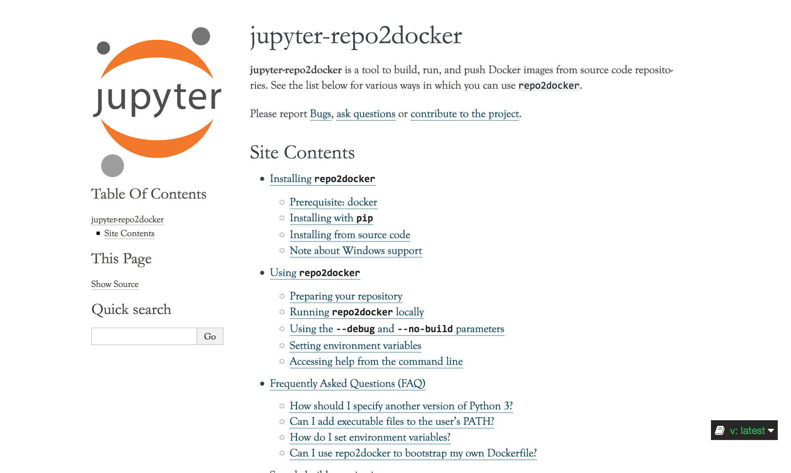

class: middle, center, title-slide

# Binder


.footnote[Tim Head, Wild Tree Tech, PyData Zurich, June 2018]

---

# Wild Tree Tech

.center.width-20[]

Tim is a doctor of experimental physics, worked at CERN and EPFL,
contributor to the PyData ecosystem.

Wild Tree Tech builds bespoke solutions for clients all around the world,
from startups to UN organisations.

* digital products that leverage machine-learning and AI,
* small and large JupyterHub deployments.

Visit [http://www.wildtreetech.com](www.wildtreetech.com).

---

class: middle, center

# Today: Getting other people's code to run

--

and cool things that become possible if you can do this.

---

# Other people's code is ... fun?!

.center.width-70[]

.footnote[From https://xkcd.com/1987/]

---

# The (data) science is the code

.larger[An article about computational science in a scientific publication is not the scholarship itself, it is merely advertising of the scholarship. The actual scholarship is the complete software development environment and the complete set of instructions which generated the figures.]

-- _Buckheit and Donoho
(paraphrasing John Claerbout),
WaveLab and Reproducible Research, 1995_

---

# What is the onboarding experience like?

.center.width-70[]

* How long till someone can reproduce work?
* How long till they can contribute to someone else's project?

Use the onboarding experience as proxy for how well sharing works.

???
* new team member joins and is given the task to expand on previous work
* sends email to everyone asking for pointers
* gets back various emails with links, documents, slides, and papers
* has to track down code used last time, it is out of date
* fiddle with the code, realise it doesn't produce the plots in the slides. Decides to either adapt the deviated code or start from scratch
* after spending time reproducing the results, or giving up and starting from scratch, do the actual work
* Finally, distribute the results through a presentation, email, or Google Doc, perpetuating the cycle

---

# What do we need for practical code sharing?

* The computational tools to solve a problem
* An interface to help us create solutions
* A way to communicate our work
* A way to share our work
* A way to pack it all so others can use it
* A way to do all of this relatively easily and accessibly

---

# Open-source languages

.gallery[


]

---

# Mature stack of libraries

.center.width-80[]

---

# Web native editors

.gallery[


]

---

# Sharing your work

.gallery[


]

---

# Specifying dependencies

.center.width-20[]

And many more language specific tools.

* language specific tools work well if you only use one language
* some tools are easier to install via the operating system's package manager
* to specify the complete computational environment a container is the right
level of abstraction

---

# Easy?

.larger[All the technical pieces exist but they require significant expertise to operate
and combine.]

---

class: middle, center

# Reality check

---

# How do we really work?

* Prototype on your laptop
* fast iteration cycles
* interactive work
* fast feedback

.center.width-90[]

---

# We built this amazing thing ...

.center.width-100[]

???

* Build yet another framework that people have to fit into
* Force people to switch tools
* Force people to work in a particular way
* No benefit from using the tool on day zero

---

class: middle, center

# repo2docker

---

# Containers - the ultimate virtual environment

Writing a `Dockerfile` is hard, and tedious. Not my definition of fun.

Most programming languages already have a way to specify dependencies.

Can't we automate creating a Docker image?

---

# repo2docker builds and runs containers from source code

.center.width-100[]

---

# repo2docker understands you

It can parse many different files that specify what dependencies to install.
This means that you can keep working the way you have always been working,
and benefit from `repo2docker` from day one.

Supported configuration files:
* `requirements.txt`
* `environment.yml`
* `apt.txt`
* `REQUIRE`
* `install.R`
* `runtime.txt`
* `postBuild`
* `Dockerfile`

---

.center.width-100.border[]

---

# Back to sharing

```
Hi Tim,

thanks for helping out on our project. To run things
you need to install Docker and then

`pip install repo2docker`.

You need to run it with the URL of the GitHub repo
and it will automatically build a docker image for
you, then launch it. It produces a lot of output but
at the end there is a URL that you need to paste into
your browser. It will show a Jupyter notebook.

Let me know how it goes,
```

.larger[
Can we make it even easier?

Maybe just a link people can click?
]

---

# Jupyter notebooks

.center.width-100[]

You are probably already using something like this.

---

# JupyterHub, serving notebooks to many people

Flexibly connects users to a computational environment provisioned somewhere else.

.left-column[
.center.width-90[]
]
.right-column[
* mature open-source technology, used to serve thousands of users
* BSD license
* commercial support available
* Active developer community (v0.9 was released on Friday!)
* Total of 116 contributors, 44 new ones for this release
]

---

class: middle, center

# Binding it all together

---

# We have all the pieces

.center[

.width-20[]

.larger[+

repo2docker

+]

.width-40[]
]

---

# JupyterHub with ondemand containers: BinderHub!

.center.width-100[]

???

Combine `repo2docker` with JupyterHub to build images for any git repository
ondemand.

We call it BinderHub.

---

# https://mybinder.org

A public BinderHub operated by the Binder team.

.center.width-100[]

---

# Pytudes on mybinder.org

https://github.com/norvig/pytudes/

.center.width-100.border[]

---

# Not just Jupyter Frontends

https://github.com/binder-examples/r

.center.border.width-100[]

---

# Who is building this?

* shout out to all the contributors!
  * super hard to find a picture or a list because we are spread over several repositories
* Join us at https://github.com/jupyterhub/binder
* Chat with us https://gitter.im/jupyterhub/binder
* Become part of the community:
    * use binder and the tools around it,
    * help explain binder to people,
    * follow our tutorials (and then help us improve them)
    * help maintaining the code,
    * take part in the operations,
    * create your own with the zero2binder guide!

---

# Who is using this?

[Users from all around the globe](https://analytics.google.com/analytics/web/#/report/visitors-geo/a101904940w149250546p154152886)

.center.width-100.border[]

---

# What do we need to do our job?

* The computational tools to solve a problem - **open source languages**
* An interface to help us create solutions - **Jupyter, RStudio, editors**
* A way to communicate our work - **notebooks**
* A way to share our work - **GitHub, GitLab, ...**
* A way to pack it all so others can use it - **containers**
* A way to do all of this relatively easily and accessibly - **BinderHub**

---

# BinderHub is a step forward in making computational work easier to reproduce

Combines the stability and scalability of JupyterHub with ondemand image building.

Anyone who wants can now make their computational project "one click" reproducible: [](https://mybinder.org/v2/gh/AllenDowney/ThinkDSP/master?filepath=code/cacophony.ipynb)

Based on state of the art cloud orchestration tools.

Can be deployed by anyone: https://binderhub.readthedocs.io/en/latest/

Tooling is useful for anyone from day one, when they are using it at home,
with no intention of sharing: `repo2docker` as virtualenv++

---

class: middle, center

# Encore

now we start the exciting part

---

# Challenge

Can you (this room) move the needle on the number of live binders?

.larger[
Visit http://bit.ly/2t9Bjql to launch your first binder.
]

<iframe src="https://grafana.mybinder.org/d-solo/fZWsQmnmz/pod-activity?refresh=30s&orgId=1&panelId=3" width="100%" height="300" frameborder="0"></iframe>

---

# Interactive documentation

https://spacy.io/usage/linguistic-features#pos-tagging

.center.width-50[]

---

# GUI like things

* https://github.com/binder-examples/appmode
* https://github.com/SimonBiggs/scriptedforms/blob/master/README.md

---

# Real GUIs - X servers!

* https://mybinder.org/v2/gh/betatim/nbnovnc/add-xeyes

.center.width-100.border[]

---

class: bottom, center

# Fin.
