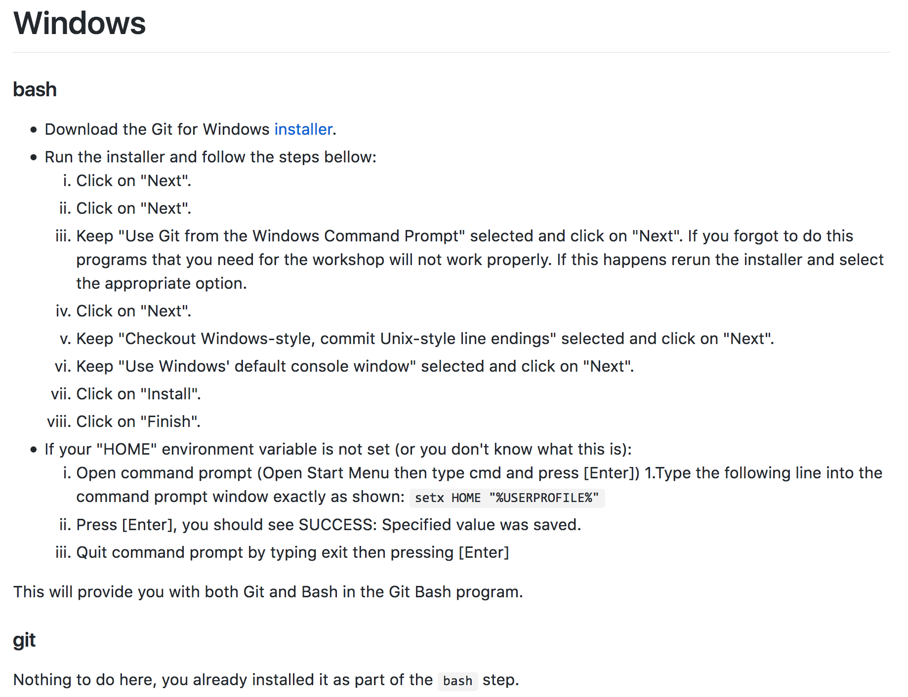
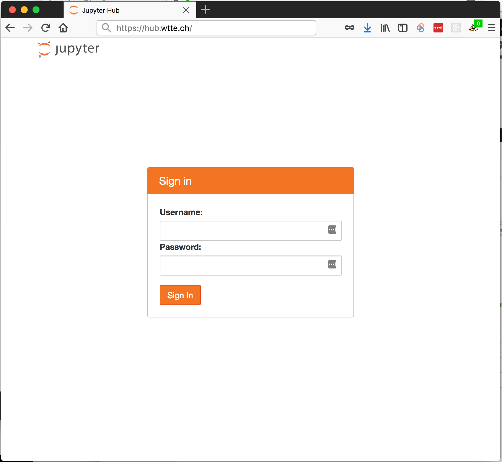
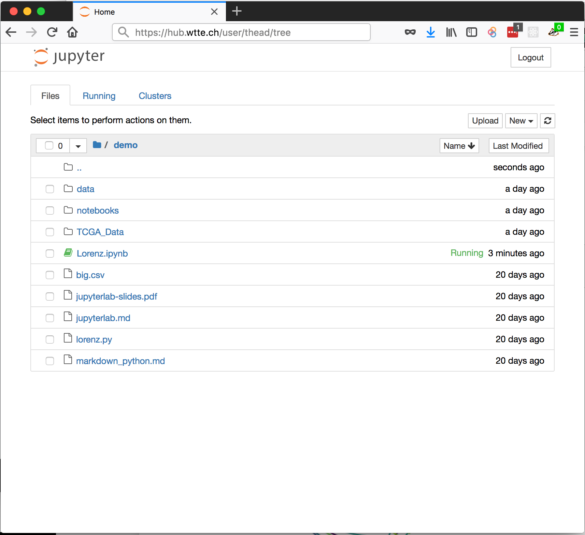
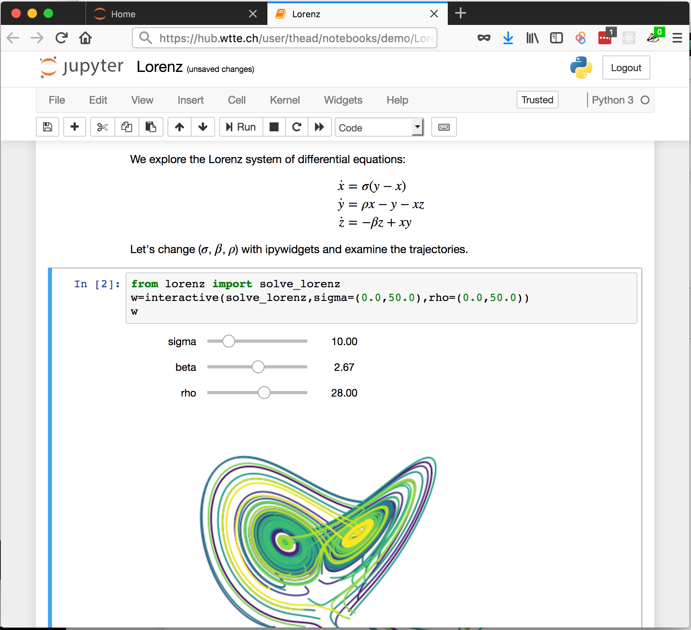
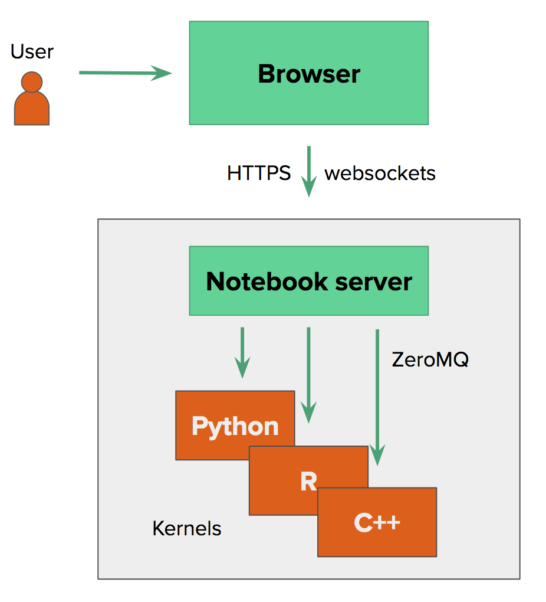
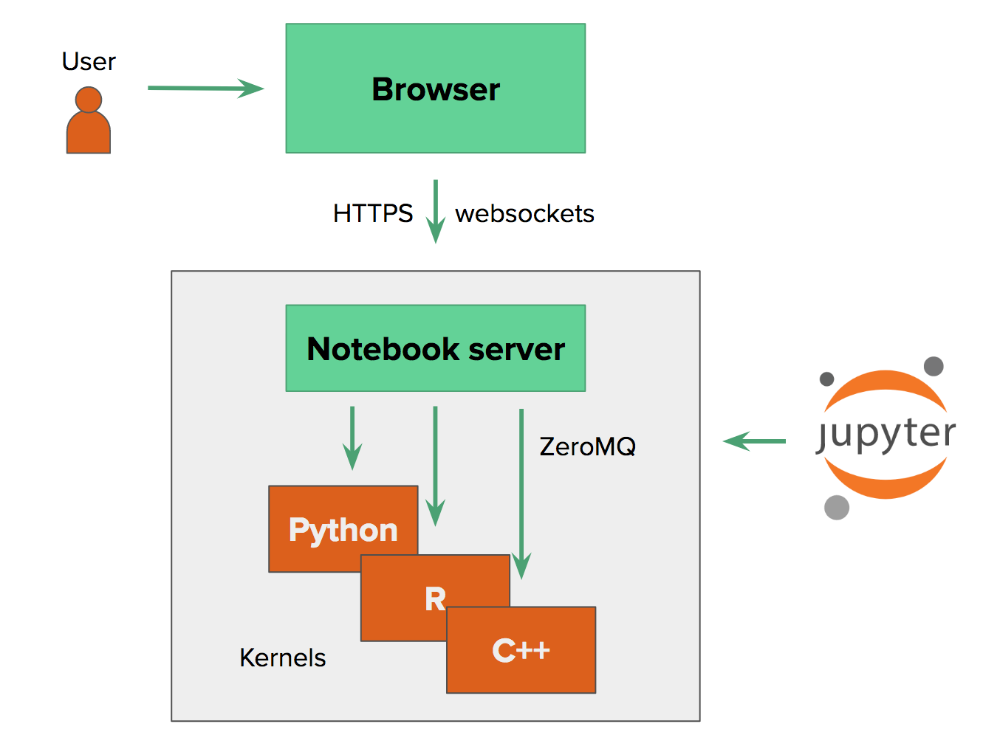
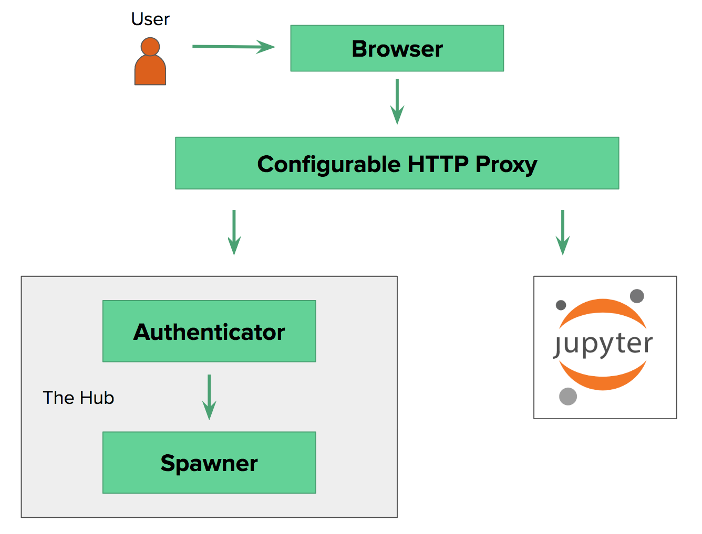
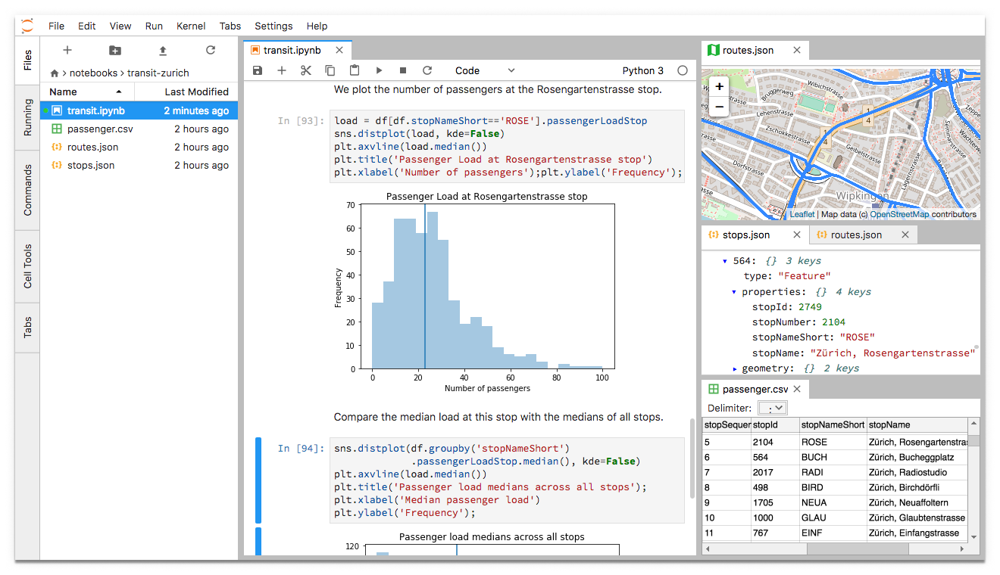

class: middle, center, title-slide

# JupyterHub

A multi-user notebook server

.footnote[Tim Head, Wild Tree Tech, April 2018]

---

class: middle, center

# Why JupyterHub?

---

# Courses

One day training or semester long courses usually involve "setup instructions"...

.width-100[]

???

JupyterHub means that there is no need to waste time on setup.

---

# Teams

.center.width-90[]

Using JupyterHub means that all work is in a central place, shared, and backed up.

???

Different team members with different levels of skills/time, different hardware,
etc. Sharing, backups, etc is hard. Limited to laptop's compute power.

---

# Instead

.center.width-80[]

---

# Instead

.center.width-90[]

---

# Instead

.center.width-100[]

---

# No laptops

All you need is a browser, centralised access to data, compute, software.

.center.width-90[]

???

This means that you could work from an iPad on the beach or ski hut or ...!

---

class: middle, center

# How does it all work?

---

# What is a notebook?

What happens when you run `jupyter notebook`?

---

# Single User Notebook

.center.width-60[]

???

A notebook is a document, coding environment, and a web application!

---

# Single User Notebook

.center.width-90[]

---

# JupyterHub

Two tasks:
* authentication of users
* launching jupyter notebook servers

One notebook server for each user.

---

# JupyterHub

.center.width-90[]

---

# Authenticators

Establishes who a user is.

* PAM (default)
* OAuth (GitHub, Google, GitLab, Globus, your OAuth provider)
* LDAP
* LTI (popular with educational services)
* NullAuthenticator (if you don't need auth)
* write your own

---

# Dictionary Based Authenticator

```
from tornado import gen
from traitlets import Dict
from jupyterhub.auth import Authenticator


class DictionaryAuthenticator(Authenticator):
    passwords = Dict(config=True,
        help="""dict of username:password for authentication"""
    )

    @gen.coroutine
    def authenticate(self, handler, data):
        """
        Check username and password against a dictionary.

        Return username if password correct, else return None.
        """
        password = self.passwords.get(data['username'])
        if password == data['password']:
            return data['username']
```

More: http://jupyterhub-tutorial.readthedocs.io/en/latest/authenticators.html

---

# Spawners

Responsible for starting a user's notebook server.

A Spawner needs to be able to:
* start the process
* poll whether the process is still running
* stop the process

Some custom spawners:
* [DockerSpawner](https://github.com/jupyterhub/dockerspawner), launch servers
  in docker containers
* [SudoSpawner](https://github.com/jupyterhub/sudospawner), JupyterHub does not
  have to be `root`
* [BatchSpawner](https://github.com/jupyterhub/batchspawner), launch user
  servers on a batch system
* [KubeSpawner](https://github.com/jupyterhub/kubespawner/), spawn user servers
  on Kubernetes
* or, your customer spawner

More: http://jupyterhub.readthedocs.io/en/latest/reference/spawners.html

---

# Sketch of a Local Process Spawner

```
class LocalProcessSpawner:
    @gen.coroutine
    def start(self):
        """Start local notebook server"""
        if self.ip:
            self.user.server.ip = self.ip
        self.user.server.port = random_port()
        cmd = []
        env = self.get_env()

        cmd.extend(self.cmd)
        cmd.extend(self.get_args())

        self.proc = Popen(cmd, env=env,
            preexec_fn=self.make_preexec_fn(self.user.name),
        )
        self.pid = self.proc.pid
        return (self.user.server.ip, self.user.server.port)
```

---

# Customise user's environment

A spawner can modify the environment of a user's server. For example inject
credentials, database paths, or Spark cluster details.

Check out [Using `auth_state`](http://jupyterhub.readthedocs.io/en/latest/reference/authenticators.html#using-auth-state) for an example of injecting auth credentials into the users environment.

---

# JupyterHub

.center.width-90[]

---

# JupyterHub - The Technology

* A Tornado application
  * `async` and `await`, oh yeah!
* BSD licensed
* Extremely customisable
* Battle tested
* Welcoming community with a mix of academics and industry
  * https://github.com/jupyterhub/jupyterhub
* Upcoming release (v0.9) in the next few weeks

---

# Deployment

Local deployment on one machine:
```
$ conda create -n jhub-demo -c conda-forge \
>       python jupyterhub notebook
$ source activate jhub-demo
$ jupyterhub
```

Good starting point to then customise for your needs.

The Full Monty: https://zero-to-jupyterhub.readthedocs.io/en/latest/
* based on kubernetes
* tested with Google Cloud
    * trying out the guide will cost you ~coffee
    * (create an account with $300 free credits)
* profit from the experience of the world's largest JupyterHub deployments

---

# Demo

* Starting JupyterHub locally
    * Admin panel
    * Custom authenticator
* EdX course: https://courses.edx.org/courses/course-v1:BerkeleyX+Data8.1x+1T2018/course/
* https://mybinder.org/, JupyterHub++
    * builds custom Docker images on demand
    * custom frontend + JupyterHub
    * served ~128000 sessions to ~85000 users over the last 30 days

Don't tell anyone but you don't even have to use jupyter notebooks with JupyterHub [RStudio works just as well](https://mybinder.org/v2/gh/binder-examples/r/master?urlpath=rstudio).

---

# ... One More Thing

JupyterLab is coming [[blog post](https://blog.jupyter.org/jupyterlab-is-ready-for-users-5a6f039b8906)]!

.center.width-100[]

---

class: middle, center

# JupyterHub is your
# {data science, science, education, machine-learning, RStudio}
# platform

---

class: middle

.center[
# Questions !??

Tim Head

tim@wildtreetech.com

Science, code, and people.

Slides: https://github.com/wildtreetech/jupyterhub-talk
]

<br />

Talk to me about:

* setting up JupyterHub
* data-science consulting
* in-house training
